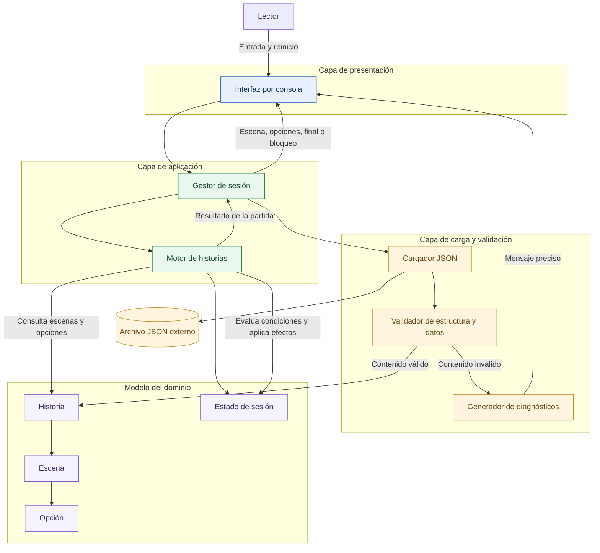

## A6. Diagrama de arquitectura de componentes

```mermaid

flowchart TB
    L["Lector"]

    subgraph PRESENTACION["Capa de presentación"]
        UI["Interfaz por consola"]
    end

    subgraph APLICACION["Capa de aplicación"]
        SES["Gestor de sesión"]
        MOTOR["Motor de historias"]
    end

    subgraph VALIDACION["Capa de carga y validación"]
        CARG["Cargador JSON"]
        VAL["Validador de estructura y datos"]
        DIAG["Generador de diagnósticos"]
    end

    subgraph DOMINIO["Modelo del dominio"]
        HIST["Historia"]
        ESC["Escena"]
        OPC["Opción"]
        EST["Estado de sesión"]
    end

    JSON[("Archivo JSON externo")]

    L -->|"Entrada y reinicio"| UI
    UI --> SES
    SES --> CARG
    CARG --> JSON
    CARG --> VAL

    VAL -->|"Contenido válido"| HIST
    VAL -->|"Contenido inválido"| DIAG
    DIAG -->|"Mensaje preciso"| UI

    HIST --> ESC
    ESC --> OPC
    SES --> MOTOR
    MOTOR --> EST
    MOTOR -->|"Consulta escenas y opciones"| HIST
    MOTOR -->|"Evalúa condiciones y aplica efectos"| EST
    MOTOR -->|"Resultado de la partida"| SES
    SES -->|"Escena, opciones, final o bloqueo"| UI

    classDef presentation fill:#e8f0fe,stroke:#356ac3,color:#17365d
    classDef application fill:#e9f7ef,stroke:#27864b,color:#174b2b
    classDef validation fill:#fff4dd,stroke:#c18b24,color:#674512
    classDef domain fill:#f5f3ff,stroke:#805ad5,color:#322659

    class UI presentation
    class SES,MOTOR application
    class CARG,VAL,DIAG,JSON validation
    class HIST,ESC,OPC,EST domain
```
