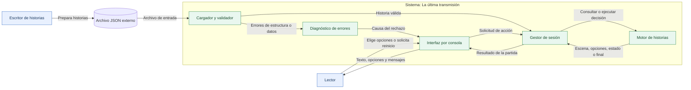
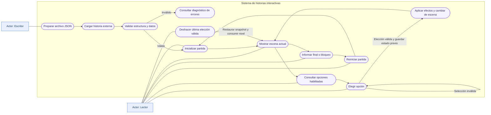
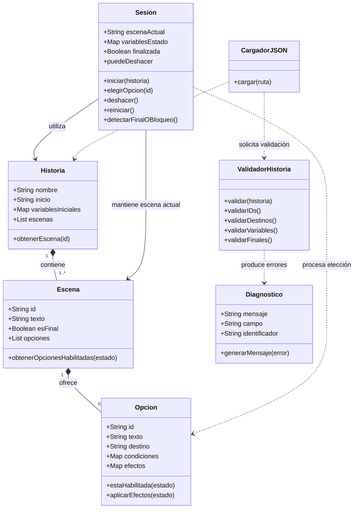
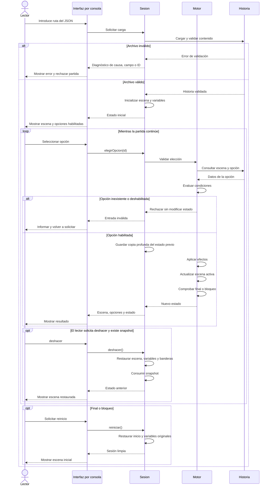
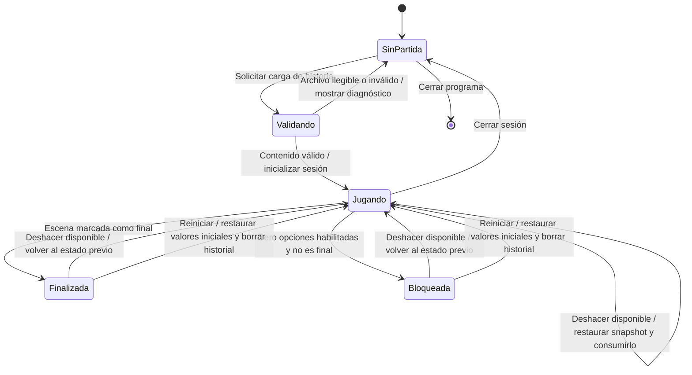

## A1. diagrama de contexto

```mermaid
flowchart LR
    L["Lector"]
    E["Escritor de historias"]
    JSON[("Archivo JSON externo")]

    subgraph SISTEMA["Sistema: La última transmisión"]
        UI["Interfaz por consola"]
        SES["Gestor de sesión"]
        MOTOR["Motor de historias"]
        VAL["Cargador y validador"]
        DIAG["Diagnóstico de errores"]
    end

    E -->|"Prepara historias"| JSON
    JSON -->|"Archivo de entrada"| VAL
    VAL -->|"Historia válida"| SES
    VAL -->|"Errores de estructura o datos"| DIAG
    DIAG -->|"Causa del rechazo"| UI

    L -->|"Elige opciones o solicita reinicio"| UI
    UI -->|"Solicitud de acción"| SES
    SES -->|"Consultar o ejecutar decisión"| MOTOR
    MOTOR -->|"Escena, opciones, estado o final"| SES
    SES -->|"Resultado de la partida"| UI
    UI -->|"Texto, opciones y mensajes"| L

    classDef actor fill:#e8f0fe,stroke:#356ac3,color:#17365d
    classDef component fill:#e9f7ef,stroke:#27864b,color:#174b2b
    class L,E actor
    class UI,SES,MOTOR,VAL,DIAG component
```

## A2. Diagrama de casos de uso

```mermaid

flowchart LR
    L["Actor: Lector"]
    E["Actor: Escritor"]

    subgraph SISTEMA["Sistema de historias interactivas"]
        UC1(["Cargar historia externa"])
        UC2(["Validar estructura y datos"])
        UC3(["Consultar diagnóstico de errores"])
        UC4(["Inicializar partida"])
        UC5(["Mostrar escena actual"])
        UC6(["Consultar opciones habilitadas"])
        UC7(["Elegir opción"])
        UC8(["Aplicar efectos y cambiar de escena"])
        UC9(["Informar final o bloqueo"])
        UC10(["Reiniciar partida"])
        UC11(["Preparar archivo JSON"])
        UC12(["Deshacer última elección válida"])
    end

    E --- UC11
    UC11 --> UC1
    UC1 --> UC2
    UC2 -->|"Válido"| UC4
    UC2 -->|"Inválido"| UC3

    L --- UC4
    L --- UC5
    L --- UC6
    L --- UC7
    L --- UC9
    L --- UC10
    L --- UC12

    UC4 --> UC5
    UC5 --> UC6
    UC6 --> UC7
    UC7 -->|"Elección válida y guardar estado previo"| UC8
    UC8 --> UC5
    UC7 -->|"Selección inválida"| UC7
    UC5 --> UC9
    UC9 --> UC10
    UC10 --> UC4
    UC12 -->|"Restaurar snapshot y consumir nivel"| UC5

    classDef actor fill:#e8f0fe,stroke:#356ac3,color:#17365d
    classDef usecase fill:#f5f3ff,stroke:#805ad5,color:#322659
    class L,E actor
    class UC1,UC2,UC3,UC4,UC5,UC6,UC7,UC8,UC9,UC10,UC11,UC12 usecase
```

## A3. Diagrama de clases del dominio

```mermaid

classDiagram
    direction TB

    class Historia {
        +String nombre
        +String inicio
        +Map variablesIniciales
        +List escenas
        +obtenerEscena(id)
    }

    class Escena {
        +String id
        +String texto
        +Boolean esFinal
        +List opciones
        +obtenerOpcionesHabilitadas(estado)
    }

    class Opcion {
        +String id
        +String texto
        +String destino
        +Map condiciones
        +Map efectos
        +estaHabilitada(estado)
        +aplicarEfectos(estado)
    }

    class Sesion {
        +String escenaActual
        +Map variablesEstado
        +Boolean finalizada
        +iniciar(historia)
        +elegirOpcion(id)
        +deshacer()
        +reiniciar()
        +puedeDeshacer
        +detectarFinalOBloqueo()
    }

    class CargadorJSON {
        +cargar(ruta)
    }

    class ValidadorHistoria {
        +validar(historia)
        +validarIDs()
        +validarDestinos()
        +validarVariables()
        +validarFinales()
    }

    class Diagnostico {
        +String mensaje
        +String campo
        +String identificador
        +generarMensaje(error)
    }

    Historia "1" *-- "1..*" Escena : contiene
    Escena "1" *-- "0..*" Opcion : ofrece
    Sesion --> Historia : utiliza
    Sesion --> Escena : mantiene escena actual
    Sesion ..> Opcion : procesa elección

    CargadorJSON ..> ValidadorHistoria : solicita validación
    CargadorJSON ..> Historia : construye contenido
    ValidadorHistoria ..> Diagnostico : produce errores
```

## A4. Diagrama de secuencia: elegir una opción

```mermaid

sequenceDiagram
    actor L as Lector
    participant UI as Interfaz por consola
    participant S as Sesion
    participant M as Motor
    participant H as Historia

    L->>UI: Introduce ruta del JSON
    UI->>S: Solicitar carga
    S->>H: Cargar y validar contenido

    alt Archivo inválido
        H-->>S: Error de validación
        S-->>UI: Diagnóstico de causa, campo o ID
        UI-->>L: Mostrar error y rechazar partida
    else Archivo válido
        H-->>S: Historia validada
        S->>S: Inicializar escena y variables
        S-->>UI: Estado inicial
        UI-->>L: Mostrar escena y opciones habilitadas

        loop Mientras la partida continúe
            L->>UI: Seleccionar opción
            UI->>S: elegirOpcion(id)
            S->>M: Validar elección
            M->>H: Consultar escena y opción
            H-->>M: Datos de la opción
            M->>M: Evaluar condiciones

            alt Opción inexistente o deshabilitada
                M-->>S: Rechazar sin modificar estado
                S-->>UI: Entrada inválida
                UI-->>L: Informar y volver a solicitar
            else Opción habilitada
                S->>S: Guardar copia profunda del estado previo
                M->>M: Aplicar efectos
                M->>M: Actualizar escena activa
                M->>M: Comprobar final o bloqueo
                M-->>S: Nuevo estado
                S-->>UI: Escena, opciones y estado
                UI-->>L: Mostrar resultado
            end

            opt El lector solicita deshacer y existe snapshot
                L->>UI: deshacer
                UI->>S: deshacer()
                S->>S: Restaurar escena, variables y banderas
                S->>S: Consumir snapshot
                S-->>UI: Estado anterior
                UI-->>L: Mostrar escena restaurada
            end
        end

        opt Final o bloqueo
            L->>UI: Solicitar reinicio
            UI->>S: reiniciar()
            S->>S: Restaurar inicio y variables originales
            S-->>UI: Sesión limpia
            UI-->>L: Mostrar escena inicial
        end
    end
```

## A5. Diagrama de estados de una sesión

```mermaid

stateDiagram-v2
    direction TB

    [*] --> SinPartida

    SinPartida --> Validando: Solicitar carga de historia

    Validando --> SinPartida: Archivo ilegible o inválido / mostrar diagnóstico
    Validando --> Jugando: Contenido válido / inicializar sesión

    Jugando --> Jugando: Elección válida / efectos y transición
    Jugando --> Jugando: Entrada inválida / conservar estado
    Jugando --> Jugando: Deshacer disponible / restaurar snapshot y consumirlo
    Jugando --> Finalizada: Escena marcada como final
    Jugando --> Bloqueada: Cero opciones habilitadas y no es final

    Finalizada --> Jugando: Deshacer disponible / volver al estado previo
    Bloqueada --> Jugando: Deshacer disponible / volver al estado previo
    Finalizada --> Jugando: Reiniciar / restaurar valores iniciales y borrar historial
    Bloqueada --> Jugando: Reiniciar / restaurar valores iniciales y borrar historial

    Jugando --> SinPartida: Cerrar sesión
    SinPartida --> [*]: Cerrar programa
```
